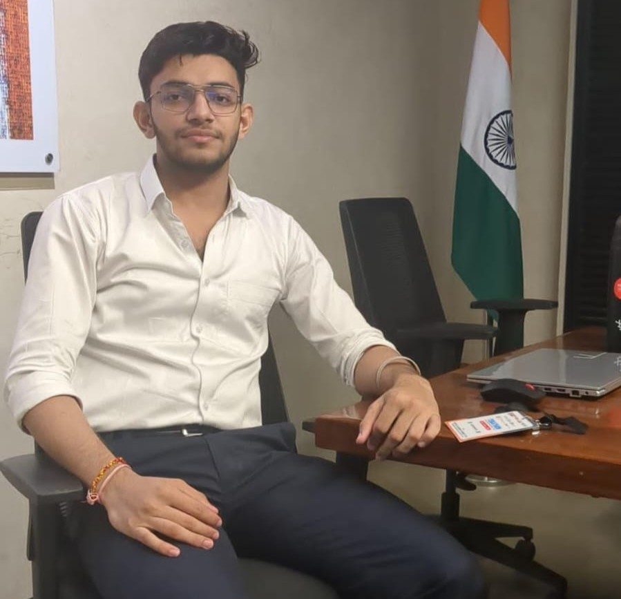

<h1 align="center">🚀 Hey, I'm Vansh Pratap Singh</h1>

  

---

## 🎓 About Me

- 💻 **B.Tech CSE Student** @ *Chandigarh University*
- 🛠️ **Backend Development Specialist** with a solid foundation in frontend technologies
- 🧠 Passionate about **AI & Machine Learning**, building models & integrating ML into apps
- 🏆 **Finalist** – *Smart India Hackathon (SIH) 2024*, Team CodeX
- 🌱 Always learning, always creating — currently diving deeper into **full-stack development** & **system design**

---

## 🛠️ Tech Arsenal

- **💡 Languages:** C++ | JavaScript | Java  
- **⚙️ Backend Frameworks:** Node.js | Express.js  
- **🎨 Frontend:** HTML | CSS | JavaScript  
- **🗄️ Databases & Modeling:** MySQL | MongoDB | MongoDB Atlas | Mongoose  
- **🧩 Tools & Platforms:** Postman | Cloudinary | StackBlitz  
- **🤖 AI/ML:** Model building & ML algorithm integration  

  

---

## 🚀 Featured Creations

- 🌍 **[DISHA](https://github.com/Vansh12970/DISHA)** – AI-powered disaster management platform (*SIH 2024 Finalist Project*)
- 🎥 **[Backend of MyPlayer](https://github.com/Vansh12970/Backend-Of-Myplayer)** – Backend for an online video player
- 📜 **[JavaScript Learning Repo](https://github.com/Vansh12970/javascript)** – My journey from JS basics to production-grade apps
- 📂 **[All My Projects](https://github.com/stars/Vansh12970/lists/projects)** – The complete showcase of my work

---

## 🏆 Achievements & Highlights

- 🏅 **Smart India Hackathon 2024 Finalist** – Built impactful AI-powered disaster management solution
- 🌟 Created full-stack apps that integrate AI for real-world problem-solving
- 📈 Consistently pushing boundaries in backend, AI, and full-stack development

---

## 💡 My Tech Journey in a Nutshell

- 🖥 Started with C++ basics → moved into web dev → mastered backend systems  
- 🤖 Ventured into **AI & ML**, training models & integrating them into live apps  
- 🎯 Mission: Build tech that **creates real-world impact**  

---

## 📬 Let’s Connect

  
  
  

---

<strong>✨ “Code with purpose, create with passion.” ✨</strong>

